# Outcome Based Education - ER Diagrams

---

## 🔐 Users & Authentication

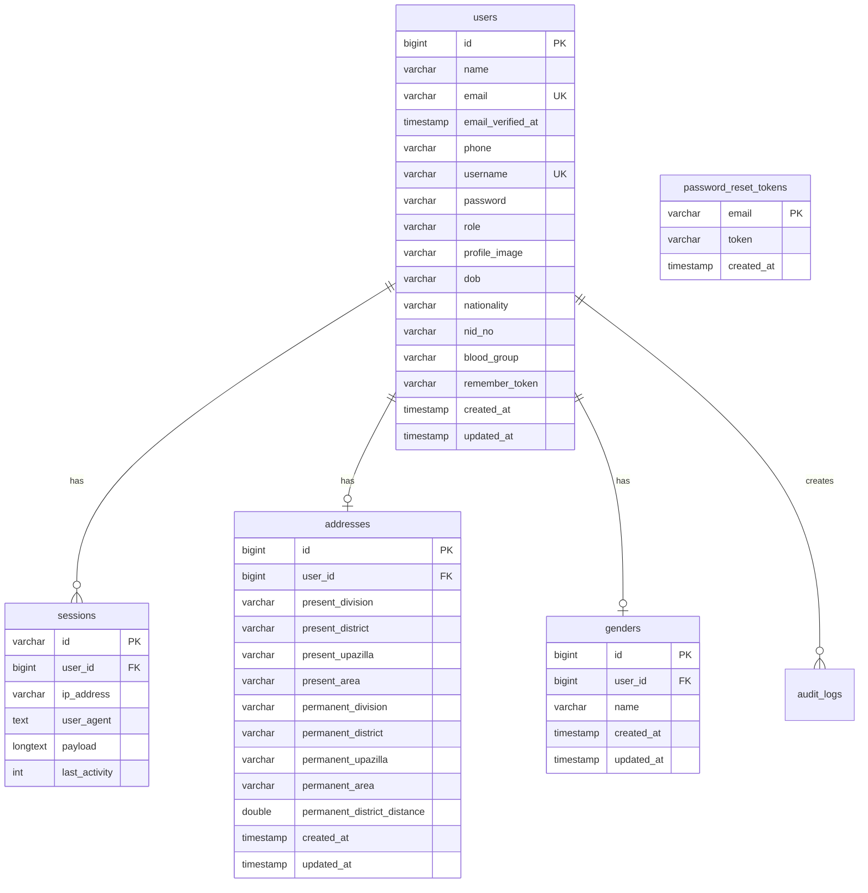
```mermaid
erDiagram
    users ||--o{ sessions : has
    users ||--o| addresses : has
    users ||--o| genders : has
    users ||--o{ audit_logs : creates

    users {
        bigint id PK
        varchar name
        varchar email UK
        timestamp email_verified_at
        varchar phone
        varchar username UK
        varchar password
        varchar role
        varchar profile_image
        varchar dob
        varchar nationality
        varchar nid_no
        varchar blood_group
        varchar remember_token
        timestamp created_at
        timestamp updated_at
    }

    sessions {
        varchar id PK
        bigint user_id FK
        varchar ip_address
        text user_agent
        longtext payload
        int last_activity
    }

    addresses {
        bigint id PK
        bigint user_id FK
        varchar present_division
        varchar present_district
        varchar present_upazilla
        varchar present_area
        varchar permanent_division
        varchar permanent_district
        varchar permanent_upazilla
        varchar permanent_area
        double permanent_district_distance
        timestamp created_at
        timestamp updated_at
    }

    genders {
        bigint id PK
        bigint user_id FK
        varchar name
        timestamp created_at
        timestamp updated_at
    }

    password_reset_tokens {
        varchar email PK
        varchar token
        timestamp created_at
    }
```

---

## 🎓 Academic Structure

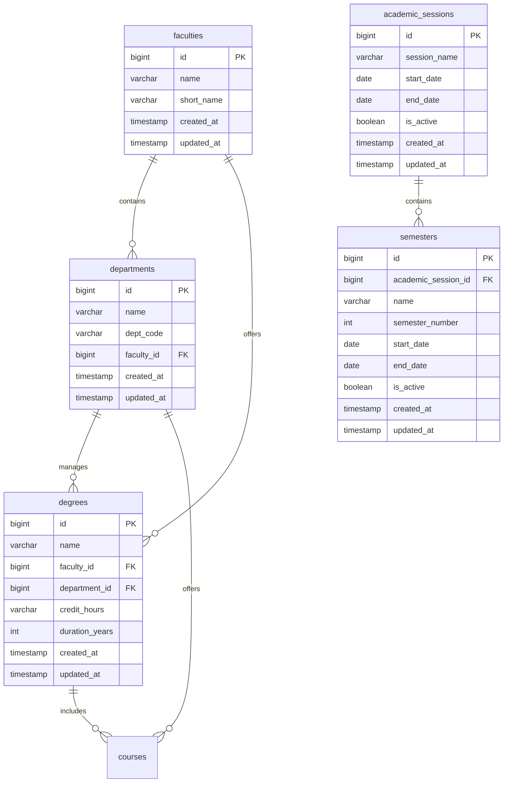
```mermaid
erDiagram
    faculties ||--o{ departments : contains
    faculties ||--o{ degrees : offers
    departments ||--o{ degrees : manages
    departments ||--o{ courses : offers
    degrees ||--o{ courses : includes

    faculties {
        bigint id PK
        varchar name
        varchar short_name
        timestamp created_at
        timestamp updated_at
    }

    departments {
        bigint id PK
        varchar name
        varchar dept_code
        bigint faculty_id FK
        timestamp created_at
        timestamp updated_at
    }

    degrees {
        bigint id PK
        varchar name
        bigint faculty_id FK
        bigint department_id FK
        varchar credit_hours
        int duration_years
        timestamp created_at
        timestamp updated_at
    }

    academic_sessions {
        bigint id PK
        varchar session_name
        date start_date
        date end_date
        boolean is_active
        timestamp created_at
        timestamp updated_at
    }

    semesters {
        bigint id PK
        bigint academic_session_id FK
        varchar name
        int semester_number
        date start_date
        date end_date
        boolean is_active
        timestamp created_at
        timestamp updated_at
    }

    academic_sessions ||--o{ semesters : contains
```

---

## 📚 Courses & Curriculum

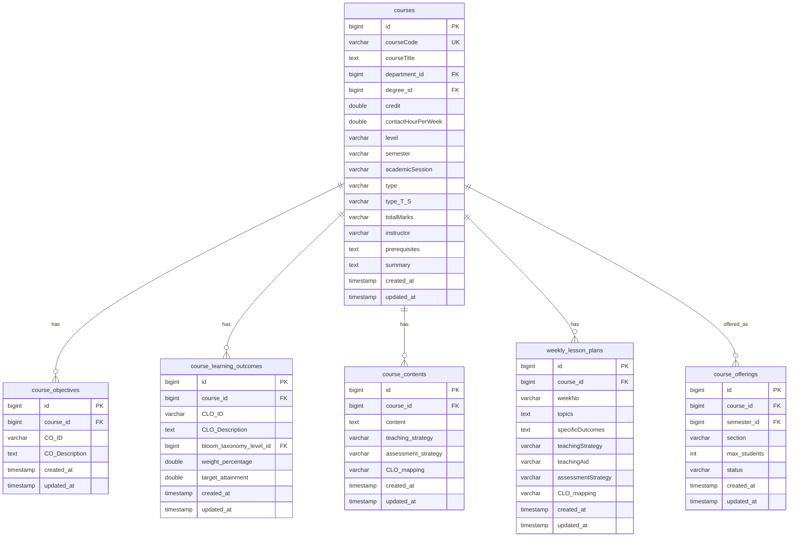
```mermaid
erDiagram
    courses ||--o{ course_objectives : has
    courses ||--o{ course_learning_outcomes : has
    courses ||--o{ course_contents : has
    courses ||--o{ weekly_lesson_plans : has
    courses ||--o{ course_offerings : offered_as

    courses {
        bigint id PK
        varchar courseCode UK
        text courseTitle
        bigint department_id FK
        bigint degree_id FK
        double credit
        double contactHourPerWeek
        varchar level
        varchar semester
        varchar academicSession
        varchar type
        varchar type_T_S
        varchar totalMarks
        varchar instructor
        text prerequisites
        text summary
        timestamp created_at
        timestamp updated_at
    }

    course_objectives {
        bigint id PK
        bigint course_id FK
        varchar CO_ID
        text CO_Description
        timestamp created_at
        timestamp updated_at
    }

    course_learning_outcomes {
        bigint id PK
        bigint course_id FK
        varchar CLO_ID
        text CLO_Description
        bigint bloom_taxonomy_level_id FK
        double weight_percentage
        double target_attainment
        timestamp created_at
        timestamp updated_at
    }

    course_contents {
        bigint id PK
        bigint course_id FK
        text content
        varchar teaching_strategy
        varchar assessment_strategy
        varchar CLO_mapping
        timestamp created_at
        timestamp updated_at
    }

    weekly_lesson_plans {
        bigint id PK
        bigint course_id FK
        varchar weekNo
        text topics
        text specificOutcomes
        varchar teachingStrategy
        varchar teachingAid
        varchar assessmentStrategy
        varchar CLO_mapping
        timestamp created_at
        timestamp updated_at
    }

    course_offerings {
        bigint id PK
        bigint course_id FK
        bigint semester_id FK
        varchar section
        int max_students
        varchar status
        timestamp created_at
        timestamp updated_at
    }
```

---

## 🎯 OBE Outcome Hierarchy

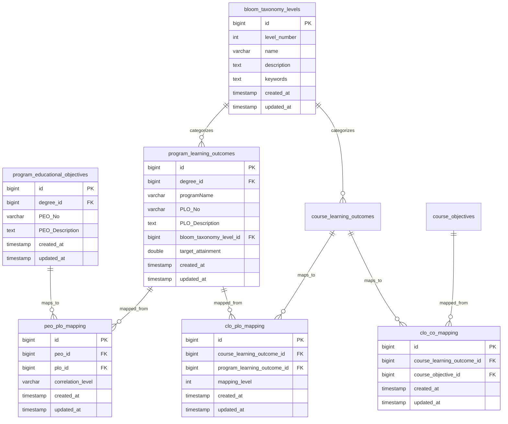
```mermaid
erDiagram
    program_educational_objectives ||--o{ peo_plo_mapping : maps_to
    program_learning_outcomes ||--o{ peo_plo_mapping : mapped_from
    program_learning_outcomes ||--o{ clo_plo_mapping : mapped_from
    course_learning_outcomes ||--o{ clo_plo_mapping : maps_to
    course_learning_outcomes ||--o{ clo_co_mapping : maps_to
    course_objectives ||--o{ clo_co_mapping : mapped_from
    bloom_taxonomy_levels ||--o{ course_learning_outcomes : categorizes
    bloom_taxonomy_levels ||--o{ program_learning_outcomes : categorizes

    bloom_taxonomy_levels {
        bigint id PK
        int level_number
        varchar name
        text description
        text keywords
        timestamp created_at
        timestamp updated_at
    }

    program_educational_objectives {
        bigint id PK
        bigint degree_id FK
        varchar PEO_No
        text PEO_Description
        timestamp created_at
        timestamp updated_at
    }

    program_learning_outcomes {
        bigint id PK
        bigint degree_id FK
        varchar programName
        varchar PLO_No
        text PLO_Description
        bigint bloom_taxonomy_level_id FK
        double target_attainment
        timestamp created_at
        timestamp updated_at
    }

    peo_plo_mapping {
        bigint id PK
        bigint peo_id FK
        bigint plo_id FK
        varchar correlation_level
        timestamp created_at
        timestamp updated_at
    }

    clo_plo_mapping {
        bigint id PK
        bigint course_learning_outcome_id FK
        bigint program_learning_outcome_id FK
        int mapping_level
        timestamp created_at
        timestamp updated_at
    }

    clo_co_mapping {
        bigint id PK
        bigint course_learning_outcome_id FK
        bigint course_objective_id FK
        timestamp created_at
        timestamp updated_at
    }
```

---

## 📝 Assessment Structure

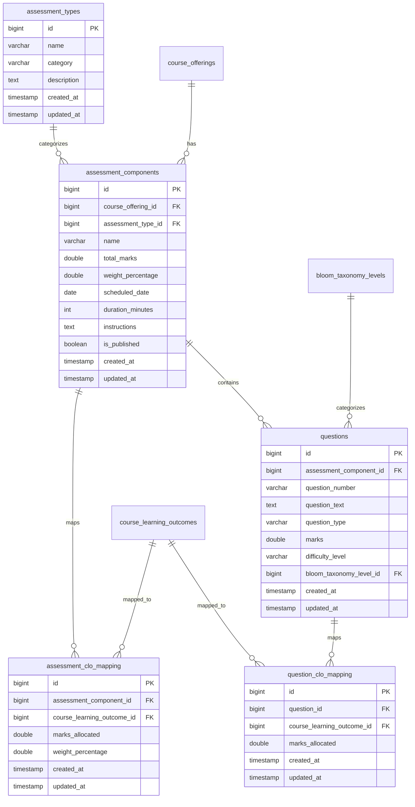
```mermaid
erDiagram
    assessment_types ||--o{ assessment_components : categorizes
    course_offerings ||--o{ assessment_components : has
    assessment_components ||--o{ assessment_clo_mapping : maps
    assessment_components ||--o{ questions : contains
    course_learning_outcomes ||--o{ assessment_clo_mapping : mapped_to
    questions ||--o{ question_clo_mapping : maps
    course_learning_outcomes ||--o{ question_clo_mapping : mapped_to
    bloom_taxonomy_levels ||--o{ questions : categorizes

    assessment_types {
        bigint id PK
        varchar name
        varchar category
        text description
        timestamp created_at
        timestamp updated_at
    }

    assessment_components {
        bigint id PK
        bigint course_offering_id FK
        bigint assessment_type_id FK
        varchar name
        double total_marks
        double weight_percentage
        date scheduled_date
        int duration_minutes
        text instructions
        boolean is_published
        timestamp created_at
        timestamp updated_at
    }

    assessment_clo_mapping {
        bigint id PK
        bigint assessment_component_id FK
        bigint course_learning_outcome_id FK
        double marks_allocated
        double weight_percentage
        timestamp created_at
        timestamp updated_at
    }

    questions {
        bigint id PK
        bigint assessment_component_id FK
        varchar question_number
        text question_text
        varchar question_type
        double marks
        varchar difficulty_level
        bigint bloom_taxonomy_level_id FK
        timestamp created_at
        timestamp updated_at
    }

    question_clo_mapping {
        bigint id PK
        bigint question_id FK
        bigint course_learning_outcome_id FK
        double marks_allocated
        timestamp created_at
        timestamp updated_at
    }
```

---

## 📋 Rubric-Based Assessment

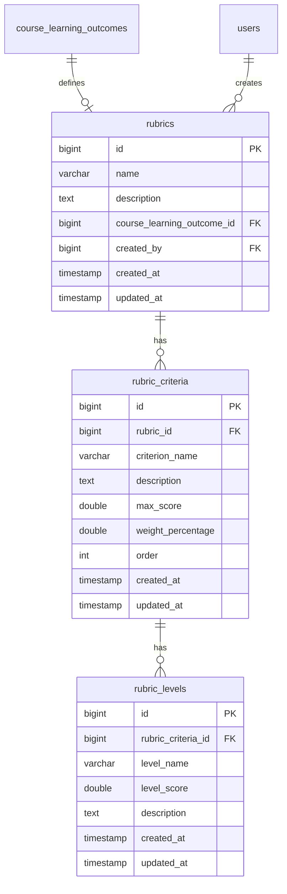
```mermaid
erDiagram
    rubrics ||--o{ rubric_criteria : has
    rubric_criteria ||--o{ rubric_levels : has
    course_learning_outcomes ||--o| rubrics : defines
    users ||--o{ rubrics : creates

    rubrics {
        bigint id PK
        varchar name
        text description
        bigint course_learning_outcome_id FK
        bigint created_by FK
        timestamp created_at
        timestamp updated_at
    }

    rubric_criteria {
        bigint id PK
        bigint rubric_id FK
        varchar criterion_name
        text description
        double max_score
        double weight_percentage
        int order
        timestamp created_at
        timestamp updated_at
    }

    rubric_levels {
        bigint id PK
        bigint rubric_criteria_id FK
        varchar level_name
        double level_score
        text description
        timestamp created_at
        timestamp updated_at
    }
```

---

## 👨‍🎓 Students & Enrollment

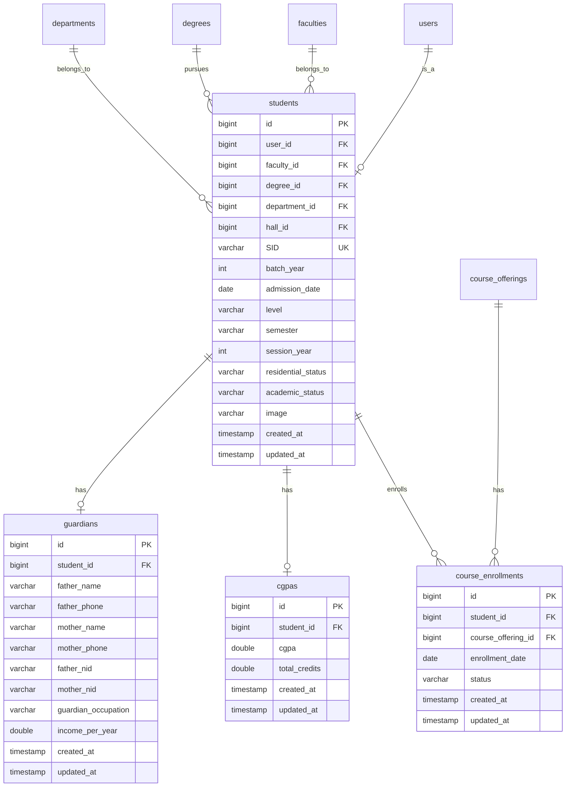
```mermaid
erDiagram
    users ||--o| students : is_a
    students ||--o{ course_enrollments : enrolls
    students ||--o| cgpas : has
    students ||--o| guardians : has
    course_offerings ||--o{ course_enrollments : has
    faculties ||--o{ students : belongs_to
    degrees ||--o{ students : pursues
    departments ||--o{ students : belongs_to

    students {
        bigint id PK
        bigint user_id FK
        bigint faculty_id FK
        bigint degree_id FK
        bigint department_id FK
        bigint hall_id FK
        varchar SID UK
        int batch_year
        date admission_date
        varchar level
        varchar semester
        int session_year
        varchar residential_status
        varchar academic_status
        varchar image
        timestamp created_at
        timestamp updated_at
    }

    course_enrollments {
        bigint id PK
        bigint student_id FK
        bigint course_offering_id FK
        date enrollment_date
        varchar status
        timestamp created_at
        timestamp updated_at
    }

    cgpas {
        bigint id PK
        bigint student_id FK
        double cgpa
        double total_credits
        timestamp created_at
        timestamp updated_at
    }

    guardians {
        bigint id PK
        bigint student_id FK
        varchar father_name
        varchar father_phone
        varchar mother_name
        varchar mother_phone
        varchar father_nid
        varchar mother_nid
        varchar guardian_occupation
        double income_per_year
        timestamp created_at
        timestamp updated_at
    }
```

---

## 👨‍🏫 Teachers & Course Assignment

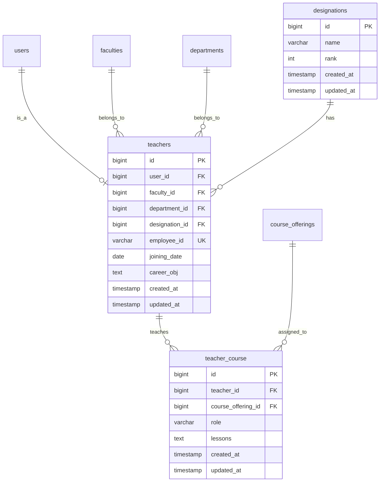
```mermaid
erDiagram
    users ||--o| teachers : is_a
    teachers ||--o{ teacher_course : teaches
    course_offerings ||--o{ teacher_course : assigned_to
    faculties ||--o{ teachers : belongs_to
    departments ||--o{ teachers : belongs_to
    designations ||--o{ teachers : has

    teachers {
        bigint id PK
        bigint user_id FK
        bigint faculty_id FK
        bigint department_id FK
        bigint designation_id FK
        varchar employee_id UK
        date joining_date
        text career_obj
        timestamp created_at
        timestamp updated_at
    }

    designations {
        bigint id PK
        varchar name
        int rank
        timestamp created_at
        timestamp updated_at
    }

    teacher_course {
        bigint id PK
        bigint teacher_id FK
        bigint course_offering_id FK
        varchar role
        text lessons
        timestamp created_at
        timestamp updated_at
    }
```

---

## 📊 Results & Marks

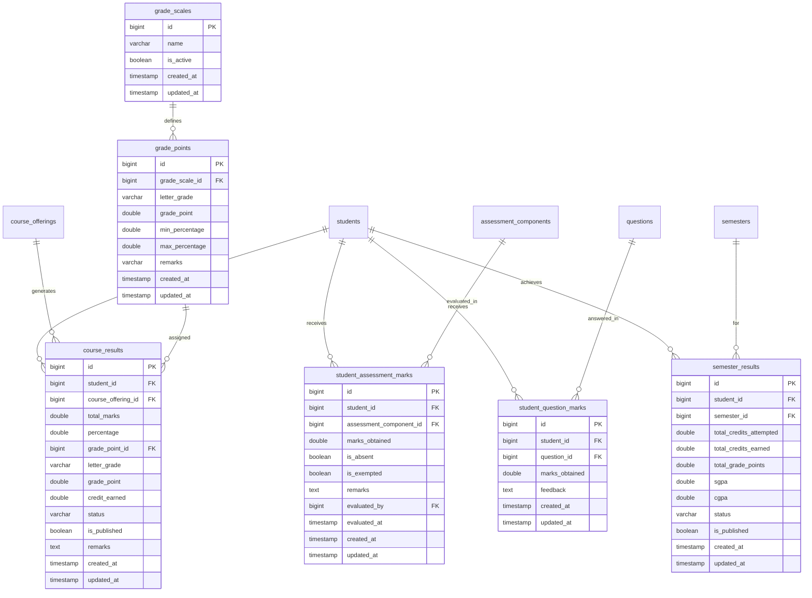
```mermaid
erDiagram
    grade_scales ||--o{ grade_points : defines
    students ||--o{ student_assessment_marks : receives
    assessment_components ||--o{ student_assessment_marks : evaluated_in
    students ||--o{ student_question_marks : receives
    questions ||--o{ student_question_marks : answered_in
    students ||--o{ course_results : achieves
    course_offerings ||--o{ course_results : generates
    grade_points ||--o{ course_results : assigned
    students ||--o{ semester_results : achieves
    semesters ||--o{ semester_results : for

    grade_scales {
        bigint id PK
        varchar name
        boolean is_active
        timestamp created_at
        timestamp updated_at
    }

    grade_points {
        bigint id PK
        bigint grade_scale_id FK
        varchar letter_grade
        double grade_point
        double min_percentage
        double max_percentage
        varchar remarks
        timestamp created_at
        timestamp updated_at
    }

    student_assessment_marks {
        bigint id PK
        bigint student_id FK
        bigint assessment_component_id FK
        double marks_obtained
        boolean is_absent
        boolean is_exempted
        text remarks
        bigint evaluated_by FK
        timestamp evaluated_at
        timestamp created_at
        timestamp updated_at
    }

    student_question_marks {
        bigint id PK
        bigint student_id FK
        bigint question_id FK
        double marks_obtained
        text feedback
        timestamp created_at
        timestamp updated_at
    }

    course_results {
        bigint id PK
        bigint student_id FK
        bigint course_offering_id FK
        double total_marks
        double percentage
        bigint grade_point_id FK
        varchar letter_grade
        double grade_point
        double credit_earned
        varchar status
        boolean is_published
        text remarks
        timestamp created_at
        timestamp updated_at
    }

    semester_results {
        bigint id PK
        bigint student_id FK
        bigint semester_id FK
        double total_credits_attempted
        double total_credits_earned
        double total_grade_points
        double sgpa
        double cgpa
        varchar status
        boolean is_published
        timestamp created_at
        timestamp updated_at
    }
```

---

## 📈 Rubric Scores & Improvement

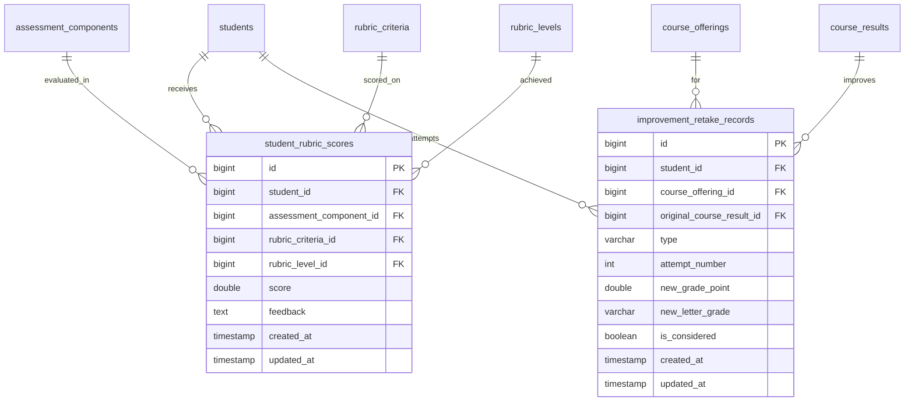
```mermaid
erDiagram
    students ||--o{ student_rubric_scores : receives
    assessment_components ||--o{ student_rubric_scores : evaluated_in
    rubric_criteria ||--o{ student_rubric_scores : scored_on
    rubric_levels ||--o{ student_rubric_scores : achieved
    students ||--o{ improvement_retake_records : attempts
    course_offerings ||--o{ improvement_retake_records : for
    course_results ||--o{ improvement_retake_records : improves

    student_rubric_scores {
        bigint id PK
        bigint student_id FK
        bigint assessment_component_id FK
        bigint rubric_criteria_id FK
        bigint rubric_level_id FK
        double score
        text feedback
        timestamp created_at
        timestamp updated_at
    }

    improvement_retake_records {
        bigint id PK
        bigint student_id FK
        bigint course_offering_id FK
        bigint original_course_result_id FK
        varchar type
        int attempt_number
        double new_grade_point
        varchar new_letter_grade
        boolean is_considered
        timestamp created_at
        timestamp updated_at
    }
```

---

## 🎯 CLO Attainment

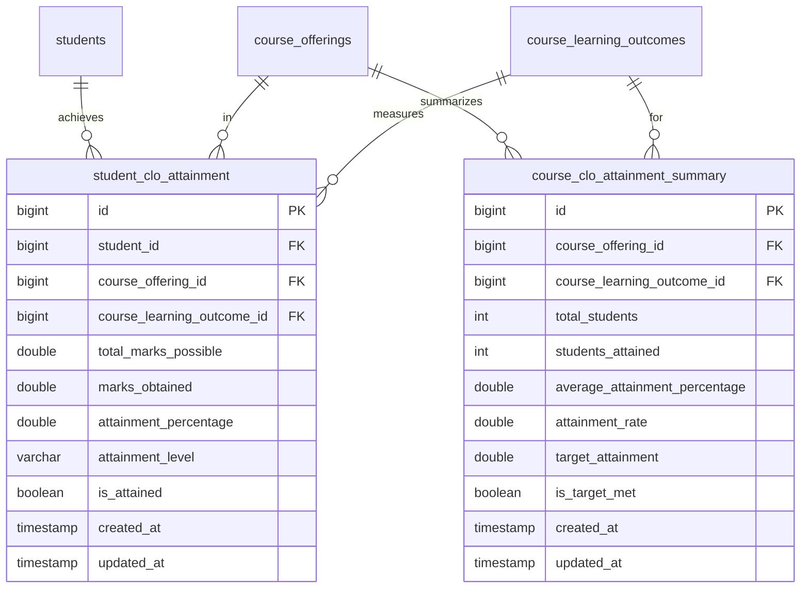
```mermaid
erDiagram
    students ||--o{ student_clo_attainment : achieves
    course_offerings ||--o{ student_clo_attainment : in
    course_learning_outcomes ||--o{ student_clo_attainment : measures
    course_offerings ||--o{ course_clo_attainment_summary : summarizes
    course_learning_outcomes ||--o{ course_clo_attainment_summary : for

    student_clo_attainment {
        bigint id PK
        bigint student_id FK
        bigint course_offering_id FK
        bigint course_learning_outcome_id FK
        double total_marks_possible
        double marks_obtained
        double attainment_percentage
        varchar attainment_level
        boolean is_attained
        timestamp created_at
        timestamp updated_at
    }

    course_clo_attainment_summary {
        bigint id PK
        bigint course_offering_id FK
        bigint course_learning_outcome_id FK
        int total_students
        int students_attained
        double average_attainment_percentage
        double attainment_rate
        double target_attainment
        boolean is_target_met
        timestamp created_at
        timestamp updated_at
    }
```

---

## 🏆 PLO Attainment

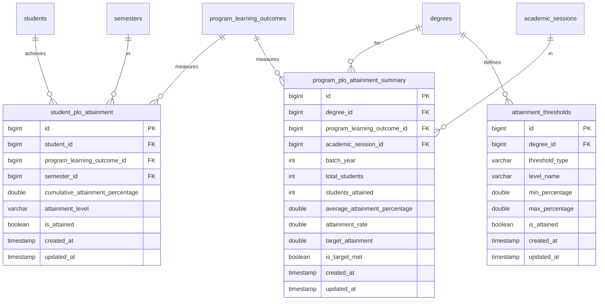
```mermaid
erDiagram
    students ||--o{ student_plo_attainment : achieves
    program_learning_outcomes ||--o{ student_plo_attainment : measures
    semesters ||--o{ student_plo_attainment : in
    degrees ||--o{ program_plo_attainment_summary : for
    program_learning_outcomes ||--o{ program_plo_attainment_summary : measures
    academic_sessions ||--o{ program_plo_attainment_summary : in
    degrees ||--o{ attainment_thresholds : defines

    student_plo_attainment {
        bigint id PK
        bigint student_id FK
        bigint program_learning_outcome_id FK
        bigint semester_id FK
        double cumulative_attainment_percentage
        varchar attainment_level
        boolean is_attained
        timestamp created_at
        timestamp updated_at
    }

    program_plo_attainment_summary {
        bigint id PK
        bigint degree_id FK
        bigint program_learning_outcome_id FK
        bigint academic_session_id FK
        int batch_year
        int total_students
        int students_attained
        double average_attainment_percentage
        double attainment_rate
        double target_attainment
        boolean is_target_met
        timestamp created_at
        timestamp updated_at
    }

    attainment_thresholds {
        bigint id PK
        bigint degree_id FK
        varchar threshold_type
        varchar level_name
        double min_percentage
        double max_percentage
        boolean is_attained
        timestamp created_at
        timestamp updated_at
    }
```

---

## 📊 Direct & Indirect Assessment Methods

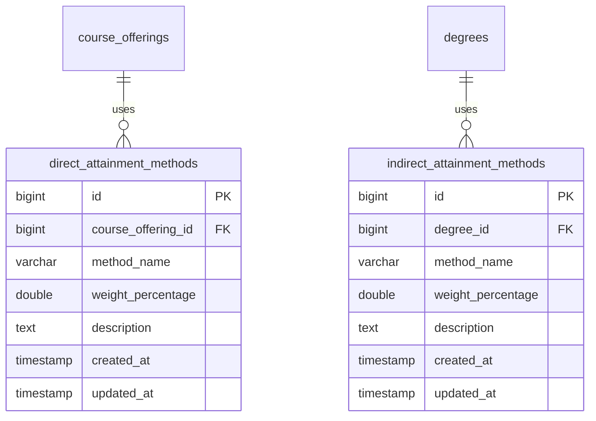
```mermaid
erDiagram
    course_offerings ||--o{ direct_attainment_methods : uses
    degrees ||--o{ indirect_attainment_methods : uses

    direct_attainment_methods {
        bigint id PK
        bigint course_offering_id FK
        varchar method_name
        double weight_percentage
        text description
        timestamp created_at
        timestamp updated_at
    }

    indirect_attainment_methods {
        bigint id PK
        bigint degree_id FK
        varchar method_name
        double weight_percentage
        text description
        timestamp created_at
        timestamp updated_at
    }
```

---

## 📋 Surveys & Feedback

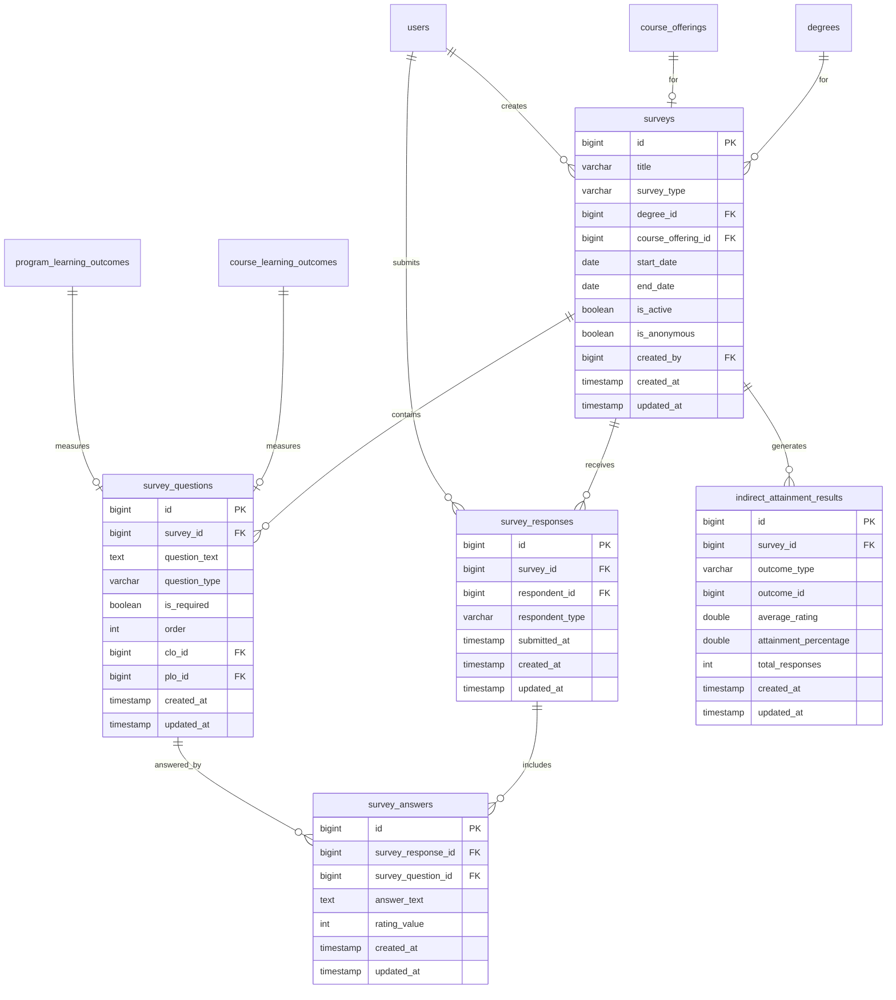
```mermaid
erDiagram
    surveys ||--o{ survey_questions : contains
    surveys ||--o{ survey_responses : receives
    survey_responses ||--o{ survey_answers : includes
    survey_questions ||--o{ survey_answers : answered_by
    degrees ||--o{ surveys : for
    course_offerings ||--o| surveys : for
    users ||--o{ surveys : creates
    users ||--o{ survey_responses : submits
    course_learning_outcomes ||--o| survey_questions : measures
    program_learning_outcomes ||--o| survey_questions : measures
    surveys ||--o{ indirect_attainment_results : generates

    surveys {
        bigint id PK
        varchar title
        varchar survey_type
        bigint degree_id FK
        bigint course_offering_id FK
        date start_date
        date end_date
        boolean is_active
        boolean is_anonymous
        bigint created_by FK
        timestamp created_at
        timestamp updated_at
    }

    survey_questions {
        bigint id PK
        bigint survey_id FK
        text question_text
        varchar question_type
        boolean is_required
        int order
        bigint clo_id FK
        bigint plo_id FK
        timestamp created_at
        timestamp updated_at
    }

    survey_responses {
        bigint id PK
        bigint survey_id FK
        bigint respondent_id FK
        varchar respondent_type
        timestamp submitted_at
        timestamp created_at
        timestamp updated_at
    }

    survey_answers {
        bigint id PK
        bigint survey_response_id FK
        bigint survey_question_id FK
        text answer_text
        int rating_value
        timestamp created_at
        timestamp updated_at
    }

    indirect_attainment_results {
        bigint id PK
        bigint survey_id FK
        varchar outcome_type
        bigint outcome_id
        double average_rating
        double attainment_percentage
        int total_responses
        timestamp created_at
        timestamp updated_at
    }
```

---

## 📈 Continuous Improvement

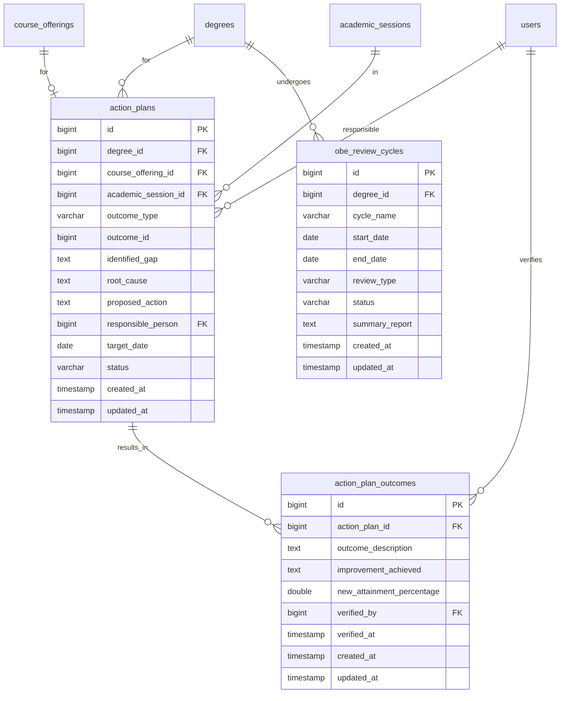
```mermaid
erDiagram
    action_plans ||--o{ action_plan_outcomes : results_in
    degrees ||--o{ action_plans : for
    course_offerings ||--o| action_plans : for
    academic_sessions ||--o{ action_plans : in
    users ||--o{ action_plans : responsible
    users ||--o{ action_plan_outcomes : verifies
    degrees ||--o{ obe_review_cycles : undergoes

    action_plans {
        bigint id PK
        bigint degree_id FK
        bigint course_offering_id FK
        bigint academic_session_id FK
        varchar outcome_type
        bigint outcome_id
        text identified_gap
        text root_cause
        text proposed_action
        bigint responsible_person FK
        date target_date
        varchar status
        timestamp created_at
        timestamp updated_at
    }

    action_plan_outcomes {
        bigint id PK
        bigint action_plan_id FK
        text outcome_description
        text improvement_achieved
        double new_attainment_percentage
        bigint verified_by FK
        timestamp verified_at
        timestamp created_at
        timestamp updated_at
    }

    obe_review_cycles {
        bigint id PK
        bigint degree_id FK
        varchar cycle_name
        date start_date
        date end_date
        varchar review_type
        varchar status
        text summary_report
        timestamp created_at
        timestamp updated_at
    }
```

---

## 📄 Reports & Audit

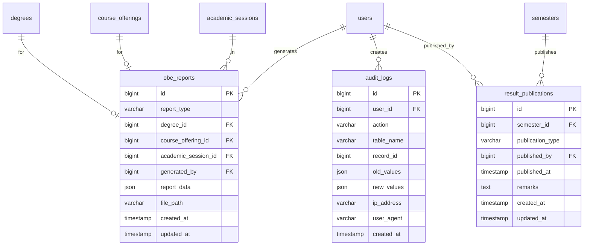
```mermaid
erDiagram
    users ||--o{ obe_reports : generates
    degrees ||--o| obe_reports : for
    course_offerings ||--o| obe_reports : for
    academic_sessions ||--o{ obe_reports : in
    users ||--o{ audit_logs : creates
    semesters ||--o{ result_publications : publishes
    users ||--o{ result_publications : published_by

    obe_reports {
        bigint id PK
        varchar report_type
        bigint degree_id FK
        bigint course_offering_id FK
        bigint academic_session_id FK
        bigint generated_by FK
        json report_data
        varchar file_path
        timestamp created_at
        timestamp updated_at
    }

    audit_logs {
        bigint id PK
        bigint user_id FK
        varchar action
        varchar table_name
        bigint record_id
        json old_values
        json new_values
        varchar ip_address
        varchar user_agent
        timestamp created_at
    }

    result_publications {
        bigint id PK
        bigint semester_id FK
        varchar publication_type
        bigint published_by FK
        timestamp published_at
        text remarks
        timestamp created_at
        timestamp updated_at
    }
```

---

## 🏢 Halls & Accommodation

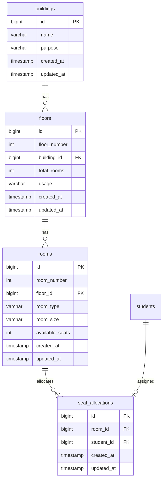
```mermaid
erDiagram
    buildings ||--o{ floors : has
    floors ||--o{ rooms : has
    rooms ||--o{ seat_allocations : allocates
    students ||--o| seat_allocations : assigned

    buildings {
        bigint id PK
        varchar name
        varchar purpose
        timestamp created_at
        timestamp updated_at
    }

    floors {
        bigint id PK
        int floor_number
        bigint building_id FK
        int total_rooms
        varchar usage
        timestamp created_at
        timestamp updated_at
    }

    rooms {
        bigint id PK
        int room_number
        bigint floor_id FK
        varchar room_type
        varchar room_size
        int available_seats
        timestamp created_at
        timestamp updated_at
    }

    seat_allocations {
        bigint id PK
        bigint room_id FK
        bigint student_id FK
        timestamp created_at
        timestamp updated_at
    }
```

---

## 🔄 Complete OBE Flow Overview

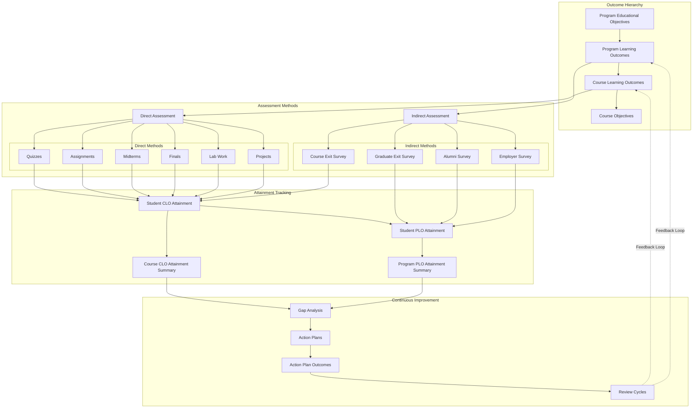
```mermaid
flowchart TB
    subgraph Outcomes["Outcome Hierarchy"]
        PEO[Program Educational Objectives]
        PLO[Program Learning Outcomes]
        CLO[Course Learning Outcomes]
        CO[Course Objectives]
    end

    subgraph Assessment["Assessment Methods"]
        DA[Direct Assessment]
        IA[Indirect Assessment]
        
        subgraph DirectMethods["Direct Methods"]
            Quiz[Quizzes]
            Assign[Assignments]
            Mid[Midterms]
            Final[Finals]
            Lab[Lab Work]
            Proj[Projects]
        end
        
        subgraph IndirectMethods["Indirect Methods"]
            CES[Course Exit Survey]
            GES[Graduate Exit Survey]
            AS[Alumni Survey]
            ES[Employer Survey]
        end
    end

    subgraph Attainment["Attainment Tracking"]
        SCA[Student CLO Attainment]
        CCA[Course CLO Attainment Summary]
        SPA[Student PLO Attainment]
        PPA[Program PLO Attainment Summary]
    end

    subgraph Improvement["Continuous Improvement"]
        GAP[Gap Analysis]
        AP[Action Plans]
        APO[Action Plan Outcomes]
        RC[Review Cycles]
    end

    PEO --> PLO
    PLO --> CLO
    CLO --> CO
    
    CLO --> DA
    PLO --> IA
    
    DA --> Quiz & Assign & Mid & Final & Lab & Proj
    IA --> CES & GES & AS & ES
    
    Quiz & Assign & Mid & Final & Lab & Proj --> SCA
    CES --> SCA
    SCA --> CCA
    SCA --> SPA
    GES & AS & ES --> SPA
    SPA --> PPA
    
    CCA --> GAP
    PPA --> GAP
    GAP --> AP
    AP --> APO
    APO --> RC
    RC -.-> |Feedback Loop| CLO
    RC -.-> |Feedback Loop| PLO
```

---

## 📊 Grading & Result Flow

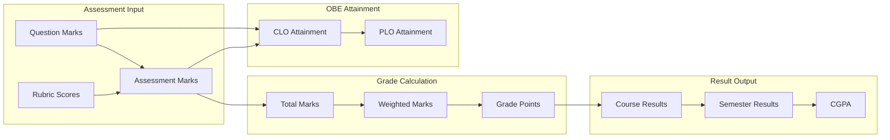
```mermaid
flowchart LR
    subgraph Input["Assessment Input"]
        QM[Question Marks]
        RS[Rubric Scores]
        AM[Assessment Marks]
    end

    subgraph Processing["Grade Calculation"]
        TM[Total Marks]
        WM[Weighted Marks]
        GP[Grade Points]
    end

    subgraph Results["Result Output"]
        CR[Course Results]
        SR[Semester Results]
        CGPA[CGPA]
    end

    subgraph Attainment["OBE Attainment"]
        CLOA[CLO Attainment]
        PLOA[PLO Attainment]
    end

    QM --> AM
    RS --> AM
    AM --> TM
    TM --> WM
    WM --> GP
    GP --> CR
    CR --> SR
    SR --> CGPA
    
    QM --> CLOA
    AM --> CLOA
    CLOA --> PLOA
```

---

## 🗂️ Table Count Summary

| Category | Tables |
|----------|--------|
| Users & Auth | 4 |
| Address & Personal | 2 |
| Academic Structure | 5 |
| Courses & Curriculum | 7 |
| OBE Outcome Mapping | 6 |
| Assessment Structure | 5 |
| Rubrics | 3 |
| Results & Marks | 8 |
| OBE Attainment | 8 |
| Surveys & Feedback | 5 |
| Continuous Improvement | 3 |
| Teachers | 3 |
| Halls & Accommodation | 4 |
| Reports & Audit | 3 |
| **Total** | **66** |
