# Outcome Based Education - ER Diagrams

---

## 🔐 Users & Authentication

---

## 🎓 Academic Structure

---

## 📚 Courses & Curriculum

---

## 🎯 OBE Outcome Hierarchy

---

## 📝 Assessment Structure

---

## 📋 Rubric-Based Assessment

---

## 👨‍🎓 Students & Enrollment

---

## 👨‍🏫 Teachers & Course Assignment

---

## 📊 Results & Marks

---

## 📈 Rubric Scores & Improvement

---

## 🎯 CLO Attainment

---

## 🏆 PLO Attainment

---

## 📊 Direct & Indirect Assessment Methods

---

## 📋 Surveys & Feedback

---

## 📈 Continuous Improvement

```mermaid
erDiagram
    action_plans ||--o{ action_plan_outcomes : results_in
    degrees ||--o{ action_plans : for
    course_offerings ||--o| action_plans : for
    academic_sessions ||--o{ action_plans : in
    users ||--o{ action_plans : responsible
    users ||--o{ action_plan_outcomes : verifies
    degrees ||--o{ obe_review_cycles : undergoes

    action_plans {
        bigint id PK
        bigint degree_id FK
        bigint course_offering_id FK
        bigint academic_session_id FK
        varchar outcome_type
        bigint outcome_id
        text identified_gap
        text root_cause
        text proposed_action
        bigint responsible_person FK
        date target_date
        varchar status
        timestamp created_at
        timestamp updated_at
    }

    action_plan_outcomes {
        bigint id PK
        bigint action_plan_id FK
        text outcome_description
        text improvement_achieved
        double new_attainment_percentage
        bigint verified_by FK
        timestamp verified_at
        timestamp created_at
        timestamp updated_at
    }

    obe_review_cycles {
        bigint id PK
        bigint degree_id FK
        varchar cycle_name
        date start_date
        date end_date
        varchar review_type
        varchar status
        text summary_report
        timestamp created_at
        timestamp updated_at
    }
```

---

## 📄 Reports & Audit

---

## 🏢 Halls & Accommodation

---

## 🔄 Complete OBE Flow Overview

---

## 📊 Grading & Result Flow

---

## 🗂️ Table Count Summary

| Category | Tables |
|----------|--------|
| Users & Auth | 4 |
| Address & Personal | 2 |
| Academic Structure | 5 |
| Courses & Curriculum | 7 |
| OBE Outcome Mapping | 6 |
| Assessment Structure | 5 |
| Rubrics | 3 |
| Results & Marks | 8 |
| OBE Attainment | 8 |
| Surveys & Feedback | 5 |
| Continuous Improvement | 3 |
| Teachers | 3 |
| Halls & Accommodation | 4 |
| Reports & Audit | 3 |
| **Total** | **66** |
